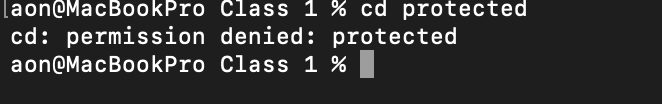
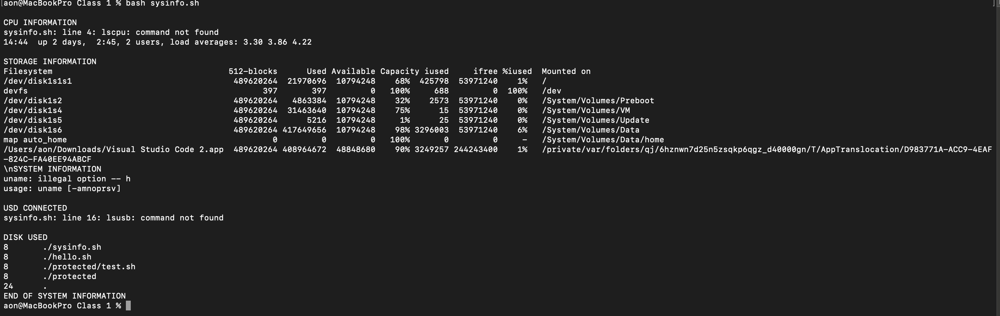

# DevOps Linux Commands Task One

This repository contains essential Linux commands for beginner DevOps engineers.

## 📁 Structure

- `Class 1/` — Introductory commands
- `protected/` — (Ensure you have permissions to access this)

## 🛠 Commands Covered

- Creating users and groups
- Managing permissions
- Git basics
- Disk space analysis
- System monitoring

## Command Output




## ✅ How to Use

Clone the repo:

```bash
git clone https://github.com/Ciscoflash/devops_linux_commands.git
